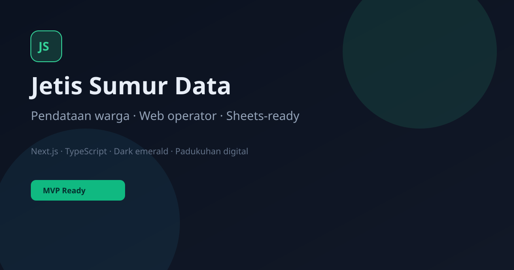

# Jetis Sumur Data

### Sistem pendataan warga padukuhan — web operator + Google Sheets ready

[](https://nextjs.org/)
[](https://www.typescriptlang.org/)
[](https://tailwindcss.com/)
[](#license)

> **Padukuhan Jetis Sumur** · Pendataan KK & jiwa yang rapi, mobile-first, siap diaudit di spreadsheet.

<p align="center">
  
</p>

---

## Mengapa produk ini

Perangkat desa sering menyimpan data warga di kertas atau file Excel di satu laptop. **Jetis Sumur Data** memberi:

| Untuk perangkat | Untuk developer / KKN |
|-----------------|------------------------|
| Cari NIK/nama dalam detik | Next.js App Router + TS |
| Input KK dari HP | PIN session aman |
| Export CSV 1 klik | Mock DB → Sheets path |
| Form pengajuan warga | PRD + DESIGN + SOP |

Bukan sekadar profil desa — ini **sistem operasional**.

---

## Fitur V1

- **Landing premium** dark + emerald (product SaaS desa)
- **Panel operator** (URL internal, tidak di navbar/sitemap)
- **CRUD Kartu Keluarga** + validasi NIK/No.KK 16 digit
- **Dashboard statistik** KK / jiwa / L-P / per RT
- **Pencarian & filter RT**
- **Pengajuan update** dari warga (antrian pending)
- **Export CSV** (flat / kk / warga)
- **Seed data demo** fiktif
- **Google Sheets adapter scaffold** (env-ready)

---

## Arsitektur

```
┌─────────────┐     ┌──────────────────┐     ┌─────────────────┐
│  Browser    │────▶│  Next.js (Vercel)│────▶│  Mock store     │
│  Publik +   │     │  /api/* + /ops   │     │  (default)      │
│  Operator   │     │                  │────▶│  Google Sheets  │
└─────────────┘     └──────────────────┘     │  (saat env set) │
                                             └─────────────────┘
```

---

## Quick start

```bash
git clone https://github.com/haviq/jetis-sumur-web.git
cd jetis-sumur-web
cp .env.example .env.local
# set ADMIN_PIN=your-secret-pin
npm install
npm run dev
```

Buka [http://localhost:3000](http://localhost:3000)

Panel operator: **`/ops`** (jangan dipasang di menu publik)

---

## Environment

| Variable | Wajib | Keterangan |
|----------|-------|------------|
| `ADMIN_PIN` | Produksi | PIN operator (≥4, rekom 8+) |
| `NEXT_PUBLIC_SITE_URL` | Opsional | Canonical URL |
| `SHEETS_SPREADSHEET_ID` | Sheets | ID spreadsheet |
| `GOOGLE_SERVICE_ACCOUNT_EMAIL` | Sheets | Email SA |
| `GOOGLE_SERVICE_ACCOUNT_PRIVATE_KEY` | Sheets | Private key (`\n` escaped) |

Tanpa Sheets env → **mode `mock`** (demo in-memory).

---

## Skrip

```bash
npm run dev        # development
npm run build      # production build
npm run start      # serve build
npm run typecheck  # tsc --noEmit
```

---

## Struktur repo

```
app/                 # routes + API
components/          # UI
content/site.json    # branding padukuhan
lib/                 # db, auth, types, sheets stub
PRD.md               # product requirements
DESIGN.md            # design system
SOP-ADMIN.md         # panduan operator
```

---

## Keamanan & privasi

- Path operator **unlisted** + `robots` disallow
- Cookie httpOnly + HMAC session
- NIK di-mask di tabel operator list
- Data seed **fiktif** — jangan commit NIK warga asli

---

## Roadmap

- [x] PRD + DESIGN + MVP mock DB  
- [x] Operator panel + export + pengajuan  
- [ ] Google Sheets full read/write  
- [ ] Import bulk Excel  
- [ ] Role per-RT  
- [ ] Grafik demografi  

---

## Dokumentasi produk

- [PRD.md](./PRD.md) — scope, FR, model data Sheets  
- [DESIGN.md](./DESIGN.md) — tokens & UI  
- [SOP-ADMIN.md](./SOP-ADMIN.md) — operasional harian  

---

## Lisensi

MIT — bebas dipakai untuk padukuhan / KKN, cantumkan kredit jika di-fork.

---

<p align="center">
  <b>Jetis Sumur Data</b> · dibangun untuk administrasi padukuhan yang lebih rapi
</p>
